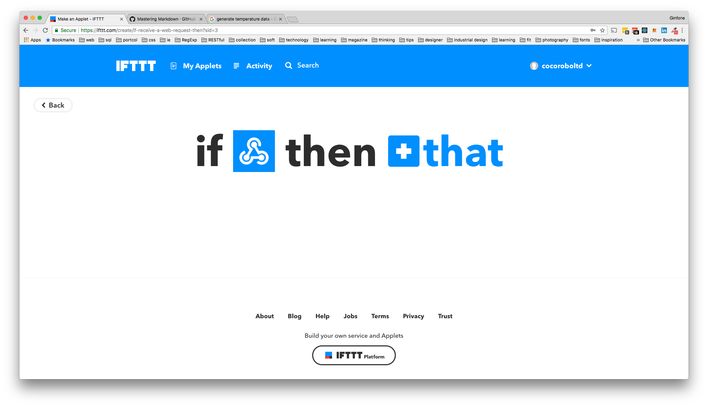

# IFTTT Webhook 配置指南

###  简介

这本指南介绍了 Webhook 分别作为 IFTTT trigger , action 与 Coco Module 结合的用法。 指南里给出了两个案例，其中一个是 webhook 当作 trigger 的时候，用 Coco 环境模块将数据经过 webhook 将数据传送到 google sheets。 另外一个则是利用 google assistant 当作 trigger，经过IFTTT webhook发送 POST 请求到 coco cloud 平台 , 进而对设备进行开关。

###  关于 IFTTT

IFTTT is the free way to get all your apps and devices talking to each other. Not everything on the internet plays nice, so we're on a mission to build a more connected world.

### 关于 webhook

Integrate other services on IFTTT with your DIY projects. You can create Applets that work with any device or app that can make or receive a web request.

其中 webhook 既可作为 **trigger** ，也可作为 **action**.

### 链接
> https://ifttt.com/

## 配置主要分为以下两个部分

* IFTTT
* cocoBlockly

## Webhook as trigger

### IFTTT
* 步骤一
  *  在官网注册一个账号

* 步骤二

  * 点击 **New Applet**

  

  * 点击 **this**

  

  * 在search service中 输入 **webhook** 并点击 **webhook**

  

  * 选择 trigger  **Receive a web request**

  

  * 设置对应的 **Event** 并点击 **Create trigger**

   一个event 名称对应一个 trigger ，如果有多个trigger，请命名多个event
   > 范例中我们生成一个 temp_data_generate的event，由此来追踪温度产生的新数据

  

  * 点击 **that**

  

  * 在 Service search 中填入 **google sheets** 并点击 **Google Sheets**

  

  * 点击 **Connect** 并登入你的google 账号

  

  * 在 Choose action 中选择 **Add row to spreadsheets**

  

  * 在 Complete action fields中填入以下几项  
    * SpreadSheet name

      > 档案的名称

    * Formatted row (用 ||| 来分隔， value1，2，3对应要添加的数据)

      >每一行要添加的资料

    * Driver folder path
      > 文件的路径 （不能为空 ，否则会失败）

  
  * 点击 **Create action**

  * 在 Review and finish 中 点击 Finish

  

### CocoBlockly
* 步骤一

  * 打开 [Blockly](http://dev.cocorobo.hk/t/cocoblockly/dev/)

* 步骤二

  * 点击 在Upload Area 处 的 **切换按钮** （接下来会看到界面变成红色)

  

* 步骤三

  * 在[积木功能栏](https://cocorobolabs.gitbooks.io/cocoblockly/content/chapter-1-introduction.html)中选择 WiFi Module -> Network -> Wifi connect setup

  

  * 在[积木功能栏](https://cocorobolabs.gitbooks.io/cocoblockly/content/chapter-1-introduction.html)中选择 WiFi Module -> Network -> if isConnected do

  

  * 在[积木功能栏](https://cocorobolabs.gitbooks.io/cocoblockly/content/chapter-1-introduction.html)中选择 WiFi Module -> Web Service -> Web Service IFTTT

  

  * 将if isConnected do 与 Web Service IFTTT 拼接在一起

  

  * 在 wifi connect setup 中填入
    * ssid （wifi的名称）
    * password (wifi的密码)
  * 在 web Service IFTTT 中填入以下

    > key 2，3 以及 value 2，3 为 optional

    * [Key](https://ifttt.com/services/maker_webhooks/settings)
      * 在 URL 在 https://maker.ifttt.com/use/ 之后的文字

      
    * event
      * 先前在IFTTT中创建的事件 *temp_data_generate*
    * value1 [*,value2, value3*]

      > 填入欲传输的数据 与 IFTTT Action中设置的 **ingredient** 相呼应

      * 假设欲传入的数据为主控板上传来的数据
      则 在[积木功能栏](https://cocorobolabs.gitbooks.io/cocoblockly/content/chapter-1-introduction.html)中选择
      以下四个块
        * WiFi Module -> Data transfer -> Data transfer setup
        * WiFi Module -> Data transfer -> Receive data to [dataIn], data length [1]
        * Lists -> set [item] to create text with [1,1,1]
        * Lists -> from [item] get item at [0]
      * 将 set [item] to create text with [1,1,1] 与  from [item] get item at [0] **拼接** 在一起，然后再同if is connected **拼接** 在一起
      * 将 [item] 变量修改为 [**dataIn**]
      

      上述步骤将Main controller 生成的数据通过数组的方式传送到WiFi板中
* 步骤四
  * 设置时间
    * 在[积木功能栏](https://cocorobolabs.gitbooks.io/cocoblockly/content/chapter-1-introduction.html)中选择 Time -> wait [1000] milliseconds
    并将其拼接在 if connected do 块的 底下.

    

### 结果查看
  此时打开Google sheets便可看到新生成的数据

  

## Webhook as Action

### IFTTT
  * 步骤一

    * 在官网注册一个账号（如有可跳过）

  * 步骤二

    * 点击 **New Applet**

    

    * 点击 **this**

    

    * 在search service中 输入 **google assistant** 并点击 **Google Assistant**

    

    * 选择 **Say a simple phrase**

    

    * 在Complete trigger fields中**填入**以下几项  

      * what do you want to say? (*turn on device*)

      * what do you want the assistant to say in response? (*device on*)

    

    * 点击 **Create trigger**

    * 点击 **that**

    
    * 在 search service 中输入 **webhooks** 并选择 **webhooks**

    

    * 在 choose action 中选择 Make a web request

    

    * 在 Complete action fields 中填入以下几项
      * URL(http://api.cocorobo.hk/iot/data/apikey/bde67044c9c426029c81b96f1f2476de80f9fa5eacc21218a0459574418a1da1/event/test)
      * Method(**POST**)
      * Content Type (application/json)
      * Body({"device":"on"})

    

    * 点击 create action
    * 点击 Finish

### Blockly
  * 步骤一
    * 打开 [Blockly](http://dev.cocorobo.hk/t/cocoblockly/dev/)
  * 步骤二
    * 注册一个账号
  * 步骤三

### 结果
此时使用手机端的Google Assistant，说‘ turn on deivce’ ，则可以看到 coco 环境板上的灯变成了紫色。
